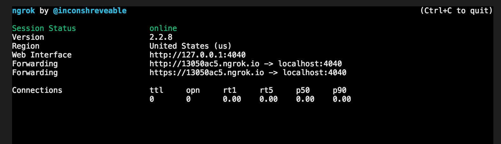
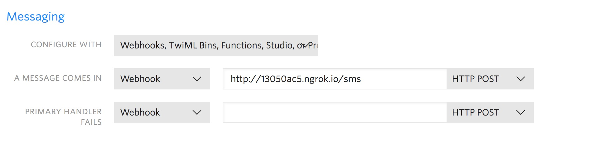

# Twilio SMS Demo

## Install the following: 

```
npm i express twilio dotenv body-parser
```

## Setup your initial node application and create your .env and .gitignore files

```
require('dotenv').config() 

const express = require('express');
const bodyParser = require('body-parser');


const app = express()
app.use(bodyParser.urlencoded({ extended: true })); 


app.listen(4040, () => console.log('listening on port 4040'))

```

Be sure to add your .env and node_modules to your .gitignore.


## Sign up on Twilio

create your first app and get the token and SID and put them into your .env as follows: 

```
TWILIO_ACCOUNT_SID=your SID number from Twilio
TWILIO_AUTH_TOKEN=your auth token from Twilio
```

Get your twilio phone number. Click on manage numbers. Get your number. They will provide you with one you just need to confirm you are okay with the one they selected for you. To your .env add the Twilio Phone Number as well as your own verified phone number. 

```
TWILIO_PHONE_NUMBER=your new twilio phone number
TWILIO_VERIFIED_PHONE_NUMBER=the verified twilio phone number
```

## Add twilio to your node

Create a constant near the top of your server called client and require `twilio`. Add the Twilio Account SID and Twilio Auth Token as the parameters to the invocation of twilio. 

```
const client = require('twilio')(
        process.env.TWILIO_ACCOUNT_SID,
        process.env.TWILIO_AUTH_TOKEN
        );
```

## Create the endpoint to send the SMS

You will need to create your endpoint then invoke client.message.create passing in an object with the from number, to number, and body of the message. Put a .then after the invocation and res.send 'Message Sent'

```
app.post('/sendSMS', (req, res) => {
    client.messages.create({
        from: process.env.TWILIO_PHONE_NUMBER,
        to: process.env.TWILIO_VERIFIED_PHONE_NUMBER,
        body: "Testing... Testing... I'm sending a text from my node server. Did it work?"
    }).then((message) => {
        res.send('Message Sent')
    });

})
```

Its important to note that with the free number you are only able to send text messages to those who have verified they are willing to receive them.


## Receiving messages

Download ngrok

https://ngrok.com/download

Upzip it. You may need to allow your computer to unzip it in the security settings. Put the ngrok file into your project and run the following from your command line
	
```
./ngrok http 4040
```

Your terminal should look like this: 



Now take the forwarding address and add it to your Twilio phone number



You are now ready to receive a text message to your new Twilio number.


## Add your response endpoint

```
const MessagingResponse = require('twilio').twiml.MessagingResponse;

app.post('/sms', function(req, res) {
    const twiml = new MessagingResponse();
    const msg = twiml.message('Check out this sweet owl!');
    
     // Add a picture message.
     msg.media('https://demo.twilio.com/owl.png');
    
     res.writeHead(200, {'Content-Type': 'text/xml'});
     res.end(twiml.toString());
});
```

The message that was sent back to you is accessed by using req.body.Body.


## Helpful Resources

https://www.twilio.com/blog/2017/10/chat-interfaces-react-javascript.html

https://www.twilio.com/docs/guides/how-to-send-sms-messages-in-node-js#send-a-message-during-a-phone-call-voice-twiml

ngrok dashboard:  http://127.0.0.1:4040